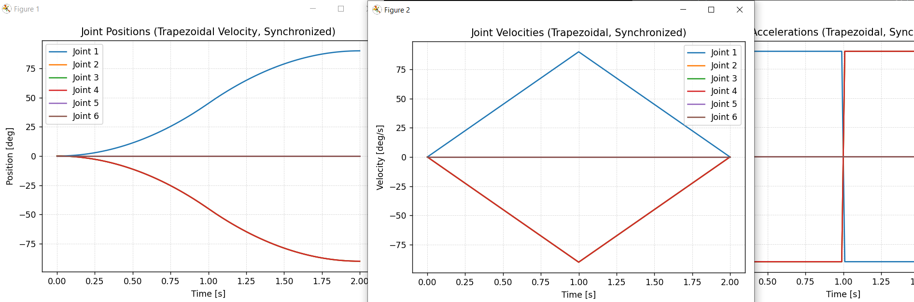

# Trapezoidal Velocity Profile Demo

A Unity C# project that implements trajactory generation using trapezoidal velocity profile.

## Overview

This project demonstrates trajectory planning using a trapezoidal velocity profile algorithm. It generates smooth motion paths with configurable sampling rate (time)m acceleration, deceleration and maximum velocity parameters. The algorithm supports both triangular and trapezoidal velocity profiles depending on the distance and parameters provided.

## Features

- **Real-time Animation**: Animated cube movement following the generated trajectory
- **Visualization**: Charts showing velocity, distance and acceleration profiles
- **Testing**: Unit tests for both edit mode and play mode scenarios

## Project Structure

```
Assets/
├── Scripts/
│   ├── TrajectoryCalculator.cs        # Trajectory generation algorithm
│   ├── TrajectoryParams.cs            # Input parameters
│   ├── TrajectoryPoint.cs             # Data structure for trajectory points
│   ├── UnityTrajectory.cs             # Unity MonoBehaviour for animation
│   └── TrajectoryChart.cs             # Visualization using XCharts
└── Tests/
│   ├── EditMode/
│   │   └── TrajectoryCalculatorTests.cs      # Unit tests for algorithm
│   └── PlayMode/
│       └── UnityTrajectoryUnitTests.cs       # Tests for Unity components
```


### Velocity Profile Types

The system automatically determines whether to use a triangular or trapezoidal profile:

- **Triangular Profile**: Used when the distance is too short to reach maximum velocity
- **Trapezoidal Profile**: Used when there's sufficient distance to reach and maintain maximum velocity

## How to Run

### Prerequisites

- Unity 2022.3 LTS or later
- XCharts package (included in project)

### Setup Instructions

1. Clone the repo
2. Open the project in Unity
3. Load the `SampleScene` from `Assets/Scenes/`
4. Press Play to see the cube animate along the trajectory
5. Adjust parameters in the Inspector to see different velocity profiles

### Parameters

The trajectory can be configured through the UI Inputs:

- **Start Point**: Initial position (Vector3)
- **End Point**: Target position (Vector3)
- **Max Velocity**: Maximum velocity (m/s)
- **Acceleration**: Acceleration rate (m/s²)
- **Deceleration**: Deceleration rate (m/s²)
- **Sampling Interval**: Time between trajectory points (seconds)

## Testing

The project includes unit tests covering:

### Edit Mode Tests (`TrajectoryCalculatorTests.cs`)
- Profile shape validation (triangular vs trapezoidal)
- Edge point accuracy (start/end positions)
- Distance continuity validation
- Peak velocity calculations
- Parameter validation and error handling

### Play Mode Tests (`UnityTrajectoryUnitTests.cs`)
- Component initialization
- Animation start/stop functionality

### Running Tests

1. Open Unity Test Runner (Window → General → Test Runner)
2. Select Edit Mode or Play Mode tab
3. Click "Run All" to execute tests

## Algorithm Details

### Trapezoidal Velocity Profile

The algorithm generates a three-phase velocity profile:

1. **Acceleration Phase**: Constant acceleration from 0 to maximum velocity
2. **Constant Velocity Phase**: Maintains maximum velocity (if distance allows)
3. **Deceleration Phase**: Constant deceleration to 0 velocity

### Mathematical Implementation

For triangular profiles (short distances, high max velocity):
```
peak_velocity = √(2 × distance × acceleration × deceleration / (acceleration + deceleration))
```

For trapezoidal profiles (long distances, low max velocity):
```
accel_time = max_velocity / acceleration
decel_time = max_velocity / deceleration
constant_time = (distance - accel_distance - decel_distance) / max_velocity
```

## Experience with Trajactory generation

This trajectory planning implementation was build upon my previous work with [URalight](https://github.com/vasu-sutariya/Uralight), my inprogress project of All-in-one software for robot motion control. Key features from that experience include:

- [Trapezoidal trajectory algorithms for UR robots in joint space](https://github.com/vasu-sutariya/Uralight/blob/Traj/Assets/Added%20files/ROBOT%20Models/Scripts/UNITY/TrajectoryCalculator.cs#L126)
- End-effector speed limits and singularity handling
- Randomized fuzz testing 

That experience helped shape some of the error handling and validation approaches used in this implementation.

### Tutorial Video

Here's a tutorial demonstrating trajectory generation in URalight with UR10 robot:

[](https://youtu.be/M2Cn9kw-wbA)

*Click the image above to watch the [URalight trajectory generation tutorial](https://youtu.be/M2Cn9kw-wbA) that covers the usage of this type of motion planning in UR10.*




